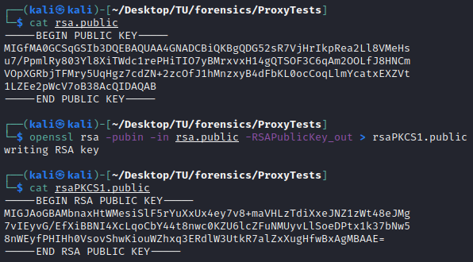

# Misc - Free Proxy (7 solves / 499 points)

  

## Write-up :

Let's summarize what we start with :
- the title and description of the challenges are talking about proxies
- two different connections we can make
- a network capture *key_exchange.pcap*

First things first, I had a very quick look to the pcap using **Network Miner** in order to extract easily any potential files, credentials, parameters and basic information but as you can see below, literally nothing useful got found here except that we deal with two hosts that have been communicating.

  

Next step was to open it with **Wireshark** to check what kind of traffic we were dealing with, the Protocol Hierarchy feature is quite handy for that. As we can see below, there has been some **Base 64** encoded data transmitted between the two hosts through TCP. 

  

Let's follow the TCP stream and put the data into **CyberChef** to decode it and see what we've here : 

  

You can easily identify two **RSA** public keys at the beginning of the stream but the rest is just garbage. It seems fair to assume that the rest of the traffic could be encrypted, possibly using RSA. By extracting the RSA parameters from the public key using **openssl**, we could see that the keys used seem to be secured enough so we won't be able to crack them to decrypt the traffic so let's move on.

  

You could continue the analysis of the problem by using the network capture or even understand it naturally with what we've got so far if you're well-versed in how the network traffic is commonly handled. However, since that's not really the path I followed, I decide to stick with the reasoning I had during the competition including the mistakes I've made. To do so, I quickly moved onto the two hosts we could connect to in order to see what was going on there. When connecting to the Host 1, we were receiving instantly some Base 64 encoded data that will remind you of the encoded RSA key we've seen earlier and you can confirm by decoding it. After that, it just waits. In the other hand, Host 2 doesn't send anything. It looks like it's just waiting for something.

  

It's time to remind you of what looks like to be the starting point of the challenge : proxies. To summarize quickly what is a proxy in case you don't know, it acts as a relay between two hosts by forwarding the traffic from A to B and back from B to A for various reasons. Since this is all we need to continue, we're going to move on so if you're particularly curious and want to learn more about proxies, don't forget that Google is your friend. Let's try to forward manually the traffic we receive for now and see what's happenning :

  

As we can see, we've a bunch of Base 64 encoded data and forwarding them from Host 1 to Host 2, Host 2 to Host 1 and so on seems to be working, the data stream keeps on being fed. The first data supplied by the Host 1 is of the same kind as what we've seen in the network capture and if we forward it to Host 2, it replies with another RSA public key. This is probably a basic key exchange in order to encrypt the traffic that will follow. So each host is giving away his public key to the other so that the other host can encrypt data using it and this way, each host will be the only capable of decrypting the received data by using the associated private key they own and as we've seen earlier, there is nothing we can do to break this directly.

However, remember that we're acting as a proxy. All the traffic is actually going through us so nothing can actually prevent us from tampering it so we could totally create our own RSA key pair and send it to both hosts just like it was the public key from the other host. This way, they each of them would encrypt the next data using our own public key meaning that we'll be able to decrypt it using the private we would have generated earlier. Seems appealing enough to try it so let's start by creating our RSA key-pair and as we've seen it earlier, we're needing 1024-bits RSA keys :

  

Next step was to encode in Base 64 and try to send it manually to see what would happen, check if it would actually work. The flow would continue only if the sent data was matching somehow the kind of data that was expected and by sending our own key, it was blocking when I tried to send my own encoded public key. By comparing my public key with the ones provides by our two hosts and with the help of a quick Google search, I was able to realize what was the problem here. They were using different padding system so I needed to convert my current public key to a **PKCS#1** public key which gives us this, still using openssl :

  

If we try again to inject our own newly converted public key, this time, it's working fine and as you can see below, Host 1 sent us the next part of data so now, let's see what we're dealing with.

  

At that point, I tried directly to decrypt that using the private key we created earlier using **openssl** :

  

I was hoping to start to see something interesting, maybe some text or some headers specific to some file types like PNG or JPEG for instance but no, only what looks like random bytes... At that point, I was thinking of two options : whether I failed the encryption/decryption process somewhere or it's actually normal. 

After verifying carefully the first option, it really looked like the RSA decryption was working fine so it meant that the random bytes were actually totally normaL. Now, I thought that I had to now possibilities : wheter the hosts were just sending random data and somewhere in the middle, there would be the flag or I was still missing something. Since the first option was easier to check while the second was kinda synonym of troubles, I went for the first one to begin with. So, here I automated the process of injecting our public key, receiving the traffic, decrypting and saving it to a file and forwarding to the other host what we received initially in order for the traffic flow to not be interrupted. As seen during first trials at the beginning of the chall, if one of the server receive nothing or something considered unexpected, the data aren't transmitted anymore but I thought that sending the encrypted then encoded data could be sufficient even if the host wouldn't be able to decrypt the data correctly as it had been encrypted for us, with our public key. But...that wasn't the case... There is probably some verification done at some point on the decrypted data to check if it matches the expected data but the important fact is that our current process isn't enough and the data stop being transmitted no matter if we wait, send random data etc.

  

We actually need to put in place a proper **Man In The Middle (MITM)**. Until now, we were only intercepting the traffic without caring about whether the normal connection would still work or not or whether it would be detected etc so it's time to fix that by setting up a proper MITM so now, we're going to intercept traffic, re-encrypt it using the original public keys provided at the beginning of the connection by the two hosts so that they can decrypt and handle the data correctly in order to have the traffic flow to continue until the end.

But...once again, something unexpected happenned and the traffic stops just after what we though was the first group of encrypted data to be sent... It stopped again but this time, I had a problem decrypting the data using our private key and it was apparently related to the length of the data to decrypt that was different from the previous one and wasn't acceptable so the decryption wasn't possible and was preventing me from going further. At that point and after trying various combinations, options and tricks to solve that issue and be able to actually decrypt this, I got stuck and eventually decided to move onto other challenges as I was kinda out of idea for the moment, a bit tilted and frustrated to feel close from the solution but still not enough.

*Note : I didn't think about it during the CTF but a clue about the situation was that even though the public keys used to encrypt the following traffic were always the same, the data transmitted after the public keys were always different so even if it could have been because the sent data was randomized except for the flag somewhere in the middle, it was more likely due to something else I was missing like another level of encryption for instance or something similar so that clue could put you back on the right track even if that wasn't the case for me 😅...*

Later that night, even if I was working on other challenges, I couldn't really get this one out of my head and at some point, I remembered two things : the size of the first encrypted data that we had been able to decrypt properly and that looked like random bytes, **128** (random) bytes and then, some basic knowledge from my cryptography classes a few years ago. These memories were about symmetric vs asymmetric encryption. **Asymmetric encryption** requiring the use of a key pair for each side, one public key used by the other sides to encrypt the data and one private key used by the first side to decrypt the data sent to him, while the **symmetric encryption** algorithms rely on one shared key/secret that all the sides have and use to encrypt and decrypt the data. For both types of encryption you've plenty of algorithms with each of them having some pros and cons but to summarize a general fact, asymmetric encryption is usually safer but slower while symmetric encryption is clearly faster but could be less safe because you need to share the secret at some point and it can be hard to share/send it safely meaning that it could be easily intercepted which would compromise all related transmissions.

Nonetheless, there is a widely used solution that is for instance the base of the **SSL/TLS** protocols that is used to secure data transmission between a client and a server while taking advantage of both types of encryption. To do that, the idea is to start with an asymmetric encryption algorithm like RSA, share the respective public keys, then a shared key for a symmetric encryption algorithm is created, encrypted using the public key of the other side and sent to this host. This way, you've been able to safely send the shared secret bypassing the security issue I was talking about earlier and now you're able to encrypt safely all the traffic using this shared key benefiting from the speed of symmetric encryption algorithms.

To conclude this reasoning, a very common symmetric encryption algorithm used in pair with the RSA that we have already identified is AES and one of its standards is **AES-128** that is using a 128-bytes long shared secret... Hope you still have in mind the first I've listed at the beginning of this part and if that's so then you know that we probably just identified the part that we were still missing. What we believed was the start of the data was actually a shared AES key that was then used to encrypt the rest of the traffic which explains everything and solve all the issues we had at that point.

Now we just need to find the AES mode that is being used for the encryption/decryption in order to finally be able to solve this challenge. Personnaly, I just checked the few possible options based on the fact that we only have a key and no other particular information so I started with **ECB** mode which didn't return anything intelligible so I moved on to next one which was **CBC** mode. Even if it normally requires an IV in addition to the key, as long as you know that shared secret, you can still decrypt a ciphertext without the IV and you'll just be missing the first block. By trying this on the first round of with the captured AES key and a random IV, we got the below result. 

  

As expected, we do have the first bytes looking random but the rest seems normal and it actually looks complete, just like a check/status message that would have been padded, which would imply that the first block wasn't part of the message itself. What if the used IV had actually been concatenated to the encrypted data before being encoded and sent ? That's also more or less common to send it like that since nothing can be done with the IV but without the key so sending it, even in cleartext, isn't a security issue in itself. Also, just so you know, you didn't have to actually think of that to solve the challenge as the part of the data where the flag is located is still recoverable without the used IVs but let's try this out to have the best result and check if our goal has finally been achieved :

  

Damn ! After all we just went through together, we finall got the flag we were looking for : `TUCTF{g1v3_M3_fr33pr0xy_0R_G1V3_m3_D347H}`

*Note : You can of course find the Python script I wrote to solve this challenge right [here](https://github.com/Khonsu-CTF/2023-TUCTF/tree/main/proxy.py). It's obviously not perfect, optimized or anything like that but it does what it has been written for so... 😉*
